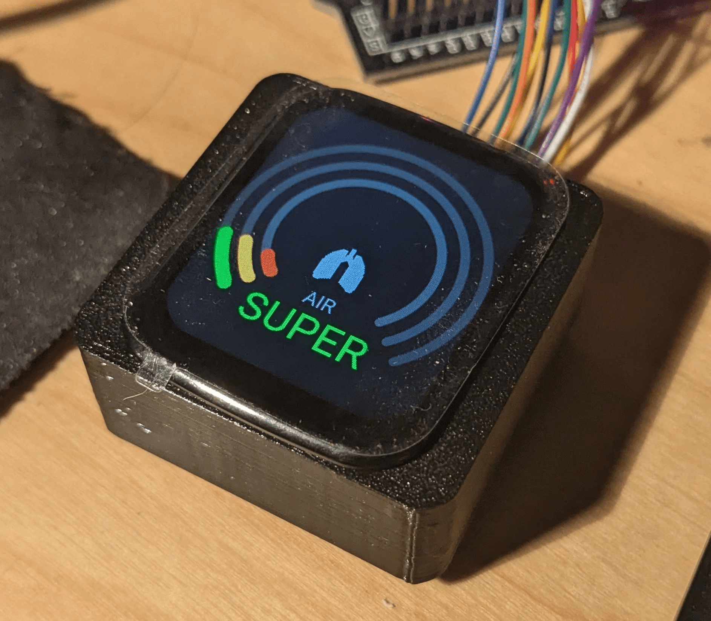

# About

This is a 3d printer enclosure controlling system using esp32 devices using
[esphome](https://esphome.io/) via [HomeAssistant](https://www.home-assistant.io/).



## Docs

See [here](https://nvtkaszpir.github.io/esphome-3d-printer-smart-enclosure).

## Code

Most of the code is in [include.lcd-touch.yaml](./include.lcd-touch.yaml), which is
then included in other files, and there some sections are overriden and/or extended.

For local development see[host.yaml](./host.yaml)
For real device see [esp32-c-ed97e4.yaml](./esp32-c-ed97e4.yaml)

make sure to have esphome installed locally to be able to compile and upload it.

```shell
pip3 install -r requirements.txt

make host
make esp32-c-ed97e4
```
