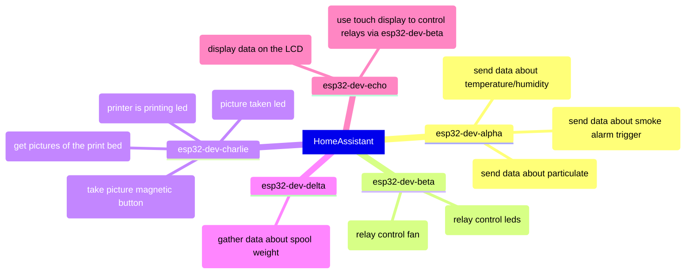

# Architecture

Well, for now this is more kind of a mind map anyway :D

Generally I have few different esp32 devices with senors connected to HomeAssistant.
Thus another device can fetch objects from HomeAssistant and process/control them.

Example:

- particulate matter sensor and calculating the generic value depending on the factors
  assuming the smaller the particulate the worse air conditions
- temperature and humidity sensors
- on/off power of the printer, lights and fans
- automatic fan on/off if the particulate level is too high + delay for additional ventilation delay

TODO: decrease number of esp32 devices :D
