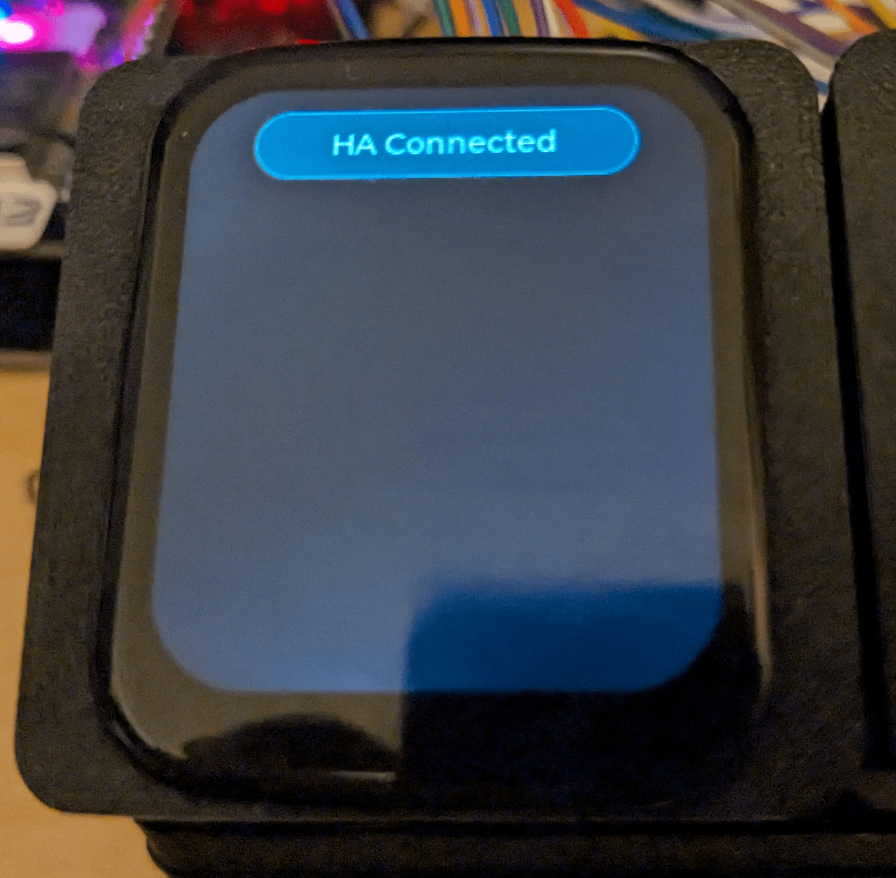
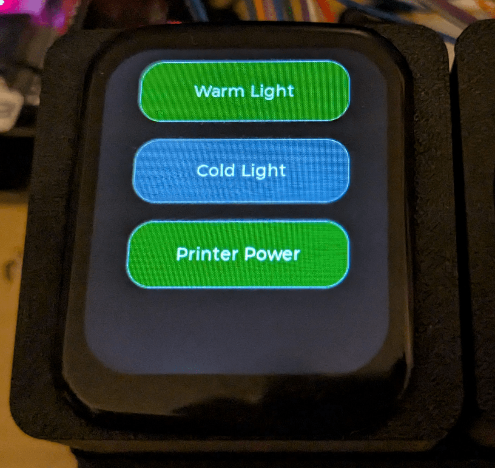
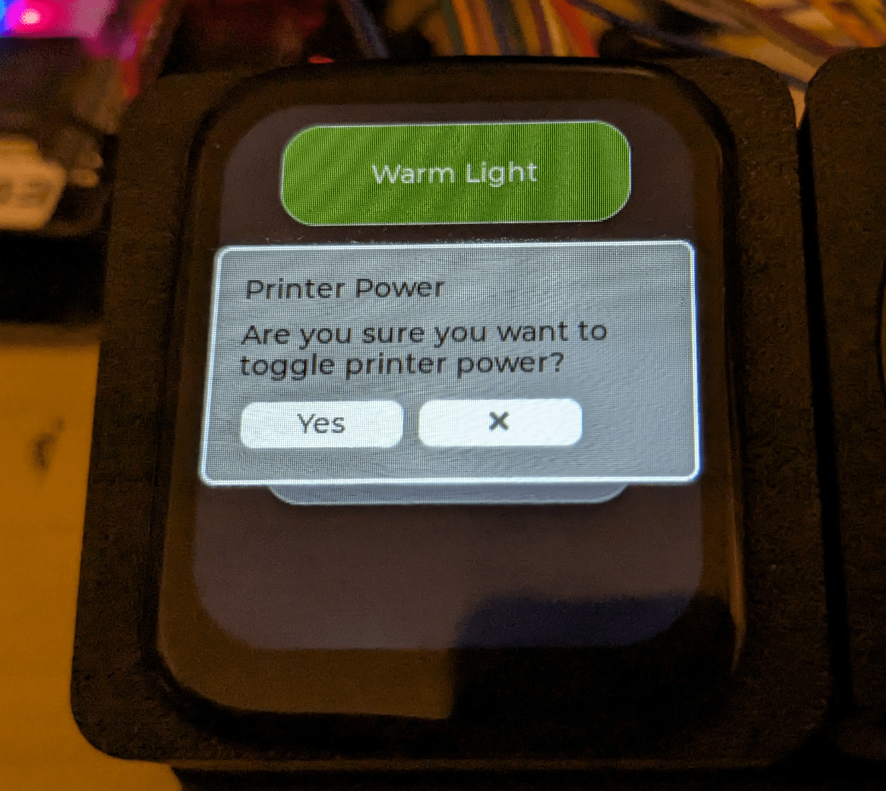

# Features

List of already implemented features:

- ugly dark theme :)
- horrid lack of esphome packages and substitutions :)

- temperature / humidity sensor - gather data from the enclosure and expose in HA

- air particulate sensor - gather data from the enclosure and expose in HA

- auto switch to the default overall air quality on idle

- power off the display if quailty is SUPER

- power back the display brightness if quality gets worse

- [relay switches](https://devices.esphome.io/devices/Generic-Relay)
  for printer power and light control

- set brightness based on the air condition status, so you are aware when it is bad

- show HA status if not connected - avoid clicking dead buttons

  {: style="height:250px;width:250px;"}

- buttons to control lights of the enclosure and the printer power

  {: style="height:250px;width:250px;"}

- printer power control, use messagebox for confirmation

  {: style="height:250px;width:250px;"}

- generate git version and bake it into the first tile, easier to track different devices
